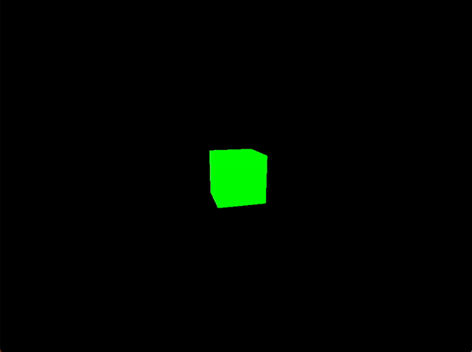
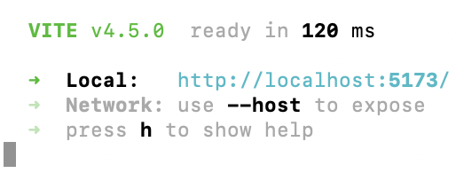

# Experiments with Three.js

Currently includes:
- Creating a static scene (spinning cube)



- Drawing lines


- Loading GLB/GLTF files  
- Allowing user to move around and pause object animation on click


# How to Install & Use

1. `clone` repository and `cd` into directory.
2. If you don't already have it, install Node.js.
3. Install three.js and a build tool, Vite:
```bash
# three.js
npm install --save three

# vite
npm install --save-dev vite
```
4. `cd` into the folder you want to examine.
5. Then run:
```bash
npx vite
```
6. You should now see a URL like http://localhost:5173/ appear in your terminal, and you can open that URL to see the web experiment.



Note: Make sure to unzip john.glb.zip in loading_objs or else you won't see him rotating in the browser (I had to compress his size even after rescaling him in Blender because of GitHub's file size limit).
# Notes

- I've noticed that when creating a new web experiment, I have to install three.js and Vite each time.
- An object's axis of rotation when you export it as a .glb/gltf file from Blender matters. I previously had john.glb's axis at the origin, so when I applied rotating animation, he rotated in a circle. I had to set origin to geometry for him to spin in place like that. 
